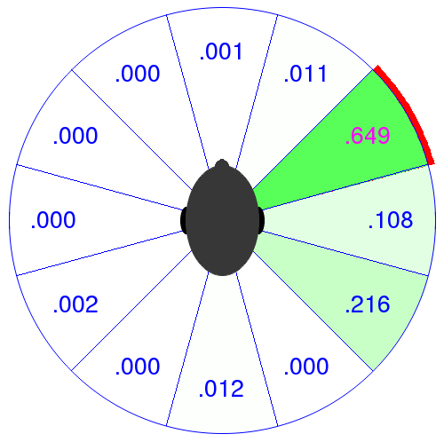

# Panotti Examples

For now the code *is* the README.    Just look at the comments in the source before you try to run anything. ;-)

Few quick thoughts:

The two *_setup* files are what you want to run.  They will grab data from elsewhere and provide prompts and instructions. 

#### Head Games
`headgames.py` is a GUI for a "live demo" I'm working on involving a pre-trained binaural localization network. 

Sample usage:

    ./headgames.py -n 8 -w /home/me/panotti/weights.hdf5 -d /home/me/panotti/Samples/Class1/

Run `./headgames.py --help` for more info

**Output:** on the screen (via the X server), you'll get a new window wiith an image of a head and several angular 'bins'.  Clicking on the image will cause the program to load a new file from the directory specified by the -d option (default is 'binaural/Samples'), and attempt to predict where it's coming from.  As shown: 

Numbers correspond to probabilities of the prediction.  Red shows the ground-truth value, and green shows the intensity of various predictions.
