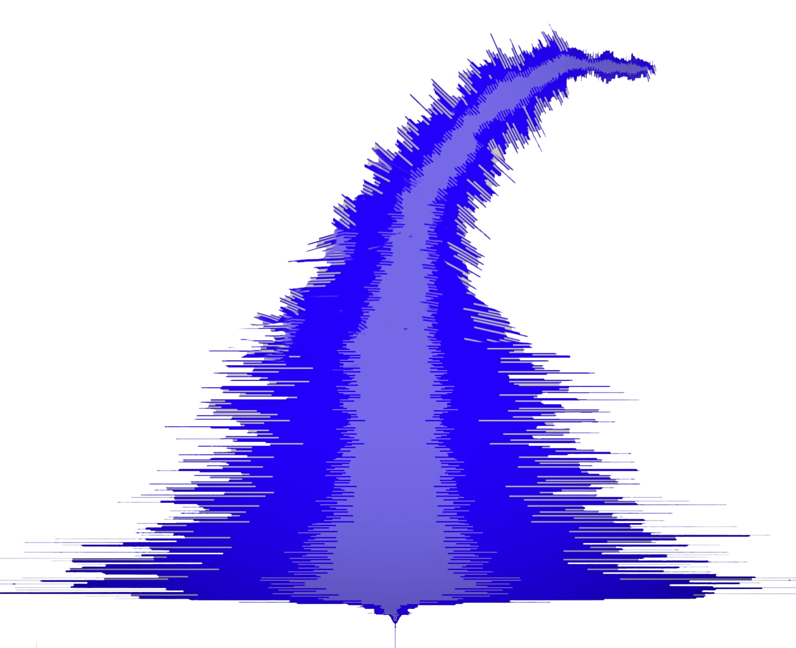
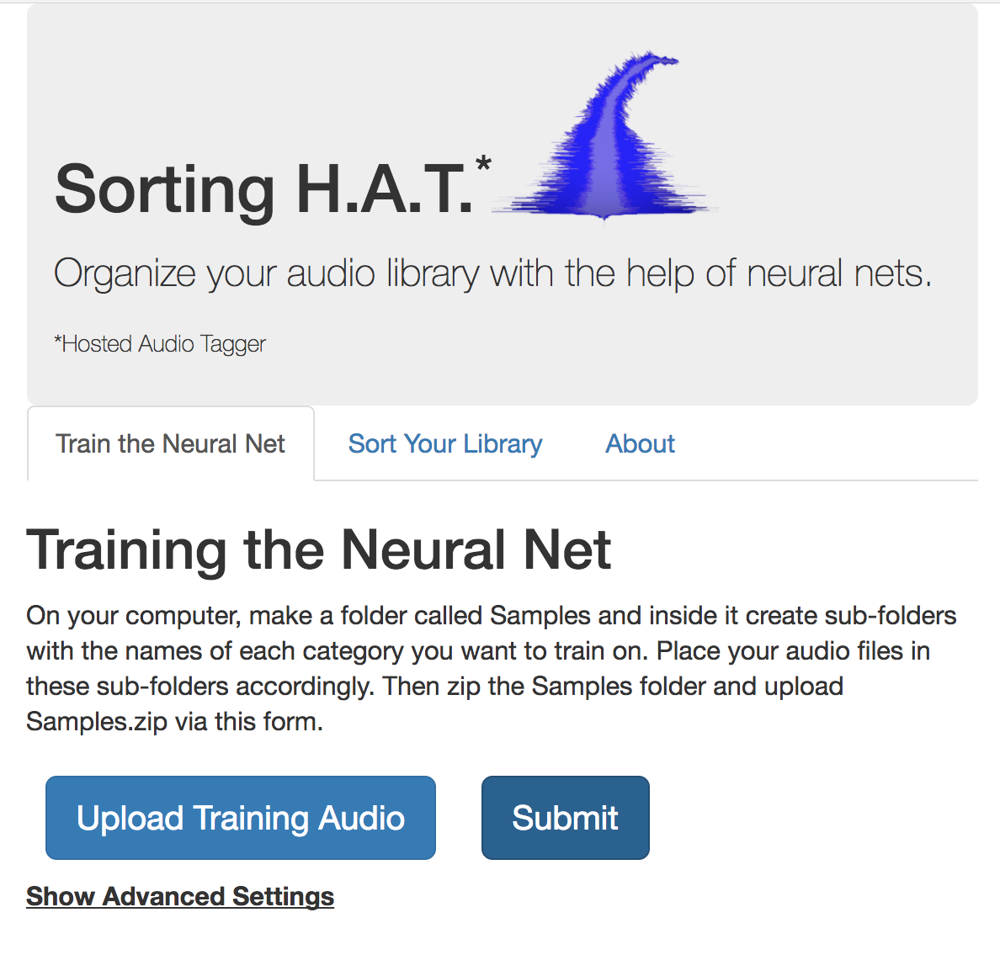

# Sorting H.A.T.*
### *Organize your audio library with the help of neural nets.*

###### *Hosted Audio Tagger

---

Sorting H.A.T. (Hosted Audio Tagger) is a cloud-based service that applies machine learning to the task of audio 'tagging'.
This task is computation-intensive and beyond the capabilities of typical laptops, which is why we use GPU (graphics processing units) hosted in the cloud!

Sorting H.A.T. can enable composers and producers to re-label their audio sample libraries
according to genre, instrument, or even personal preferences.

It is essentially a user-friendly interface to the [Panotti](http://github.com/drscotthawley/panotti) audio classifier code.

## Requirements:
- panotti (requires keras, tensorflow,...)
- flask

## To Run:

    $ python sorting-hat.py

This starts an HTTP host on port 8000.  Once it's running, point your web browser to the URL of the machine running sorting-hat.py,
e.g. http://127.0.0.1:8000 for localhost.

## Screenshot:

---
*Sorting H.A.T. is a product of Team 15 at the HackMT 2018 Hackathon: Scott Hawley, Braden Carei, Daniel Ellis, Will Haase, Braiden King, Tyler Thomas.*  
